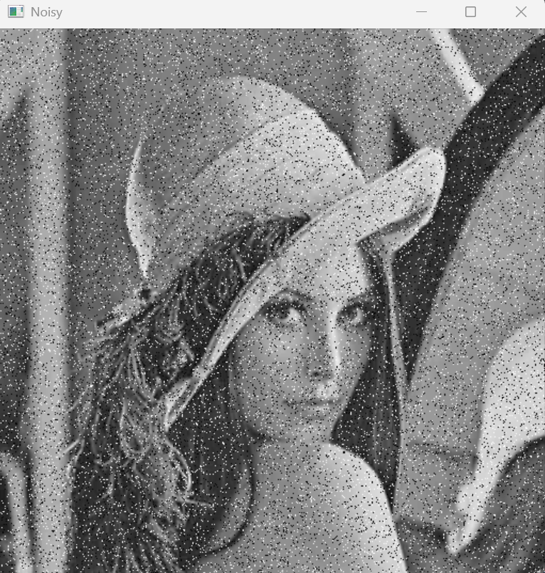
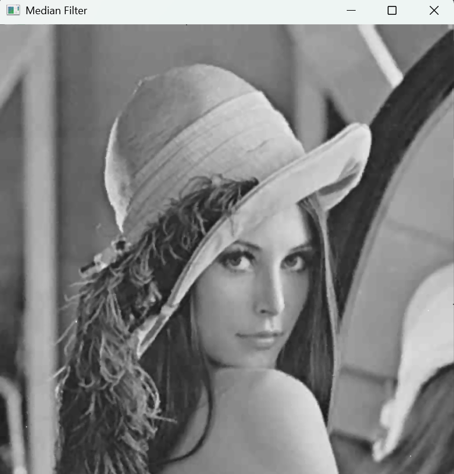
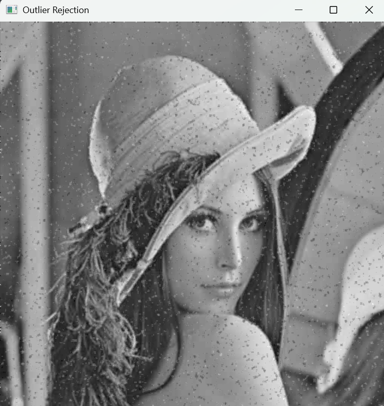
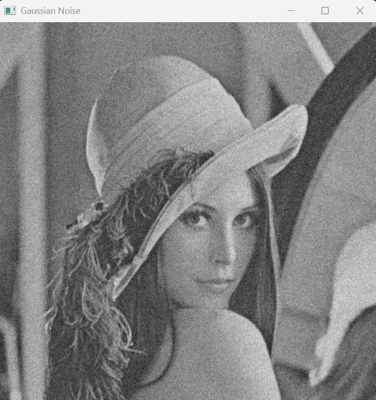
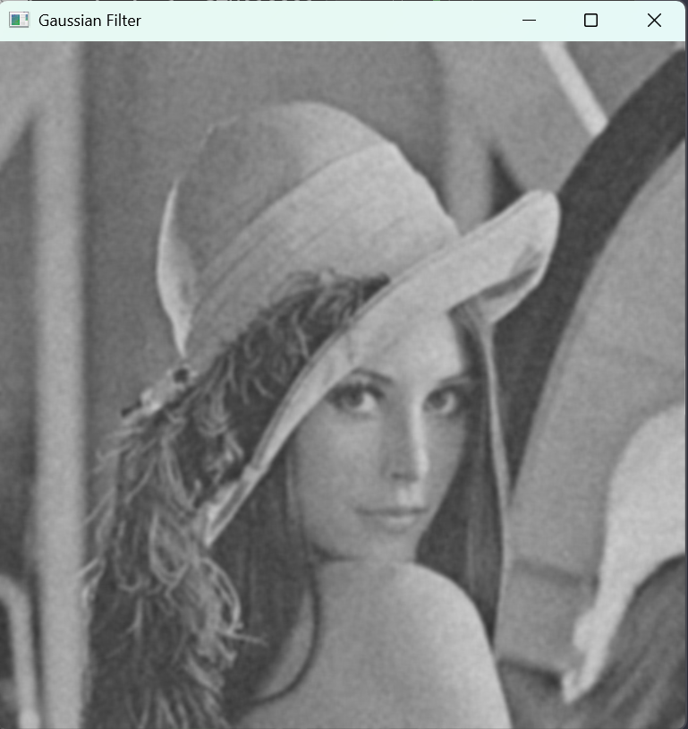
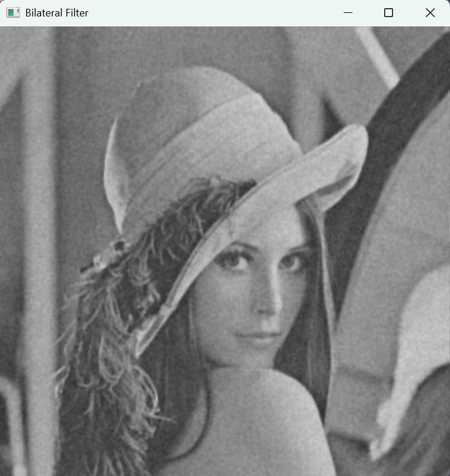

# 🧼 Image Restoration

**이미지 복원(Image Restoration)** 은 손상되거나 저하된 이미지를 원래의 깨끗한 상태로 되돌리는 영상처리 기술입니다.  
노이즈 제거(Denoising), 블러 복원(Deblurring), 결손 복구(Inpainting) 등 다양한 복원 기법이 존재합니다.

이 문서에서는 주요 복원 기술의 개념과 함께, OpenCV를 활용한 간단한 구현 예제를 소개합니다.

  
## 📂 주요 주제

### 0. 🧱 기초: Filtering  
기본적인 필터링 개념 및 구현은 아래 글글에서 확인할 수 있습니다.  
- [🔍 Filtering과 Convolution](https://he-kate1130.tistory.com/139)  
- [🎚️ High & Low Pass Filter](https://he-kate1130.tistory.com/140)
- [🤺 Unsharp Masking](https://he-kate1130.tistory.com/141)

### 1. 📉 Degradation & Noise
[🔗 Image Noise와 Degradation에 대해서 알아보자](https://he-kate1130.tistory.com/142)
- Degradation
    - `Noise`,`Out-of-Focus Blur`,`Motion Blur`
- Noise
    - `Salt and Pepper Noise`, `Gaussian Noise`, `Speckle Noise`, `Periodic Noise`

### 2. 🧪 노이즈 제거 
[🔗 Denoising 실습](https://he-kate1130.tistory.com/143)
- **Salt and Pepper Noise Removal**  
  - `Median Filtering`, `Outlier Rejection Method`

- **Gaussian Noise Removal**  
  - `Simple Average Filtering`, `Bilateral Filtering`
  - `Bilateral Filtering vs. Gaussian Filtering`

  
## 📌 결과 미리보기
> **Salt and Pepper Noise 제거 결과**

|Salt&Pepper Noise|Averaging Filter|Median Filter|Outlier Rejection|
|--|--|--|--|
|||||

> **Gaussian Noise Removal 제거 결과**

|Gaussian Noise|Gaussian Filter|Bilateral Filter|
|--|--|--|
||||

  
## 🔗 작성 포스팅 모음
- [🔗 Image Noise와 Degradation](https://he-kate1130.tistory.com/142)
- [🔗 Image Denoising](https://he-kate1130.tistory.com/143)

  
## 📖 참고 자료
- [🗒️ OpenCV 튜토리얼: Smooting Images](https://docs.opencv.org/4.11.0/dc/dd3/tutorial_gausian_median_blur_bilateral_filter.html)
