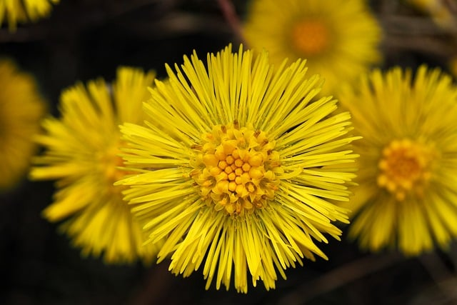
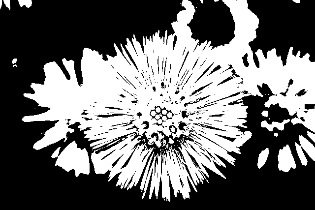
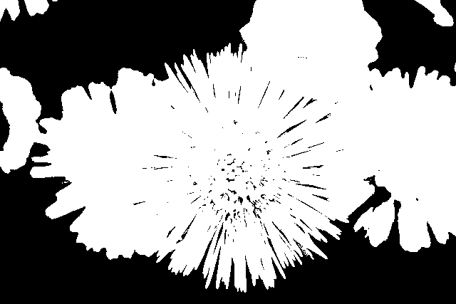
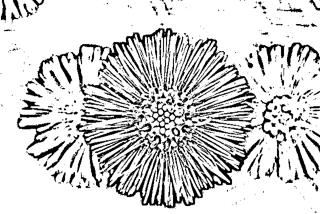

# 🧩 Image Segmentation

이미지 세그멘테이션은 이미지를 의미 있는 영역으로 나누는 작업입니다.  
Thresholding, K-means Clustering, Mean Shift와 같은 다양한 접근 방식들을 실습과 함께 정리하였습니다.

 

## 📂 주요 주제

### 1. Thresholding
- `Simple Thresholding`
- `Otsu’s Method`
- `Adaptive Thresholding`

### 2. Clustering 기반 세그멘테이션
- `K-means Clustering`
- `Mean Shift Algorithm`

> 각 기법별로 이론 설명 + 코드 구현 + 시각적 결과 포함

 

## 📌 결과 미리보기

> **✅ Thresholding 결과**  

| 원본 | Simple Thresholding | Otsu's Method | Adaptive Thresholding |
|:--:|:-------------:|:-------------:|:-------------:|
|  |  |  |  |

> **✅ K-means Clustering 결과**  

> **✅ Mean Shift Segmentation 결과**  

 

## 🔗 작성 포스팅

- 🧠 [Segmentation 이론 정리](https://he-kate1130.tistory.com/144)  

 

## 📖 참고 자료