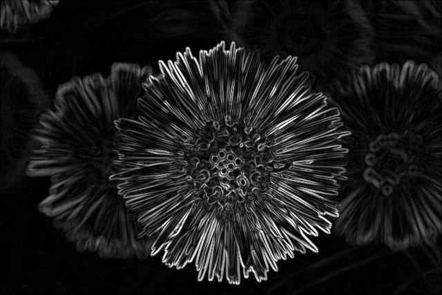
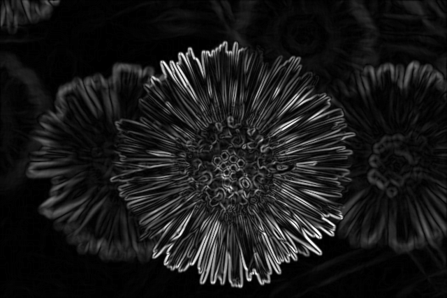
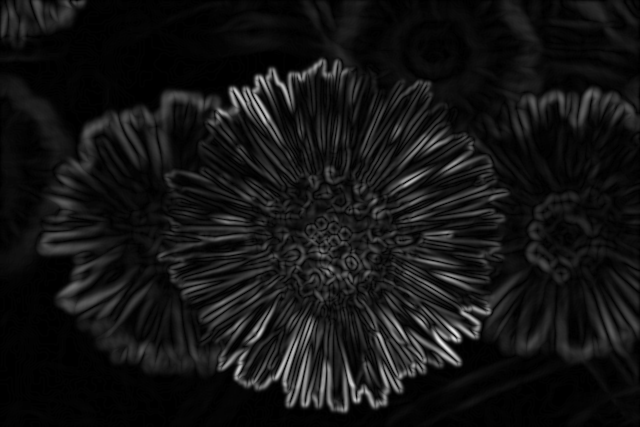
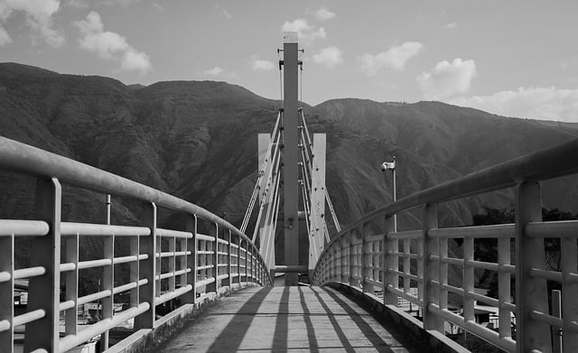
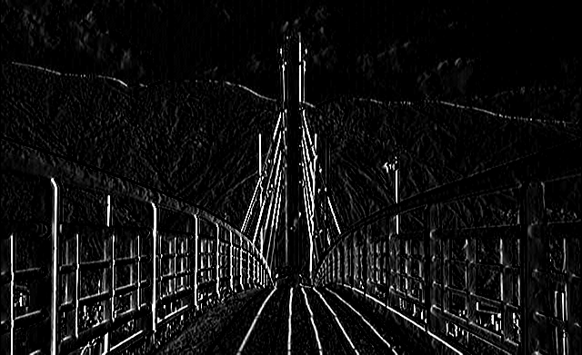
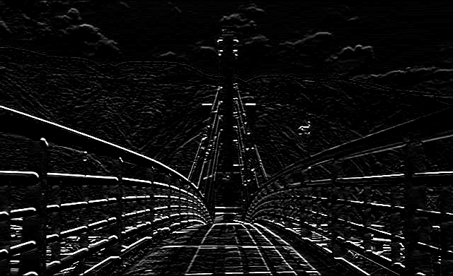
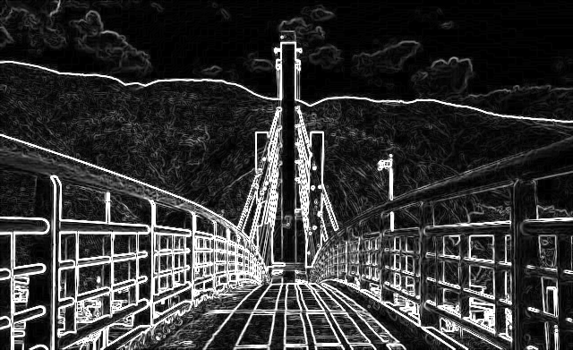
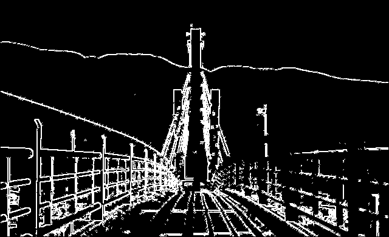
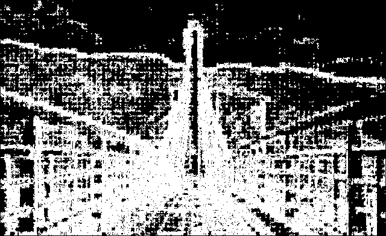
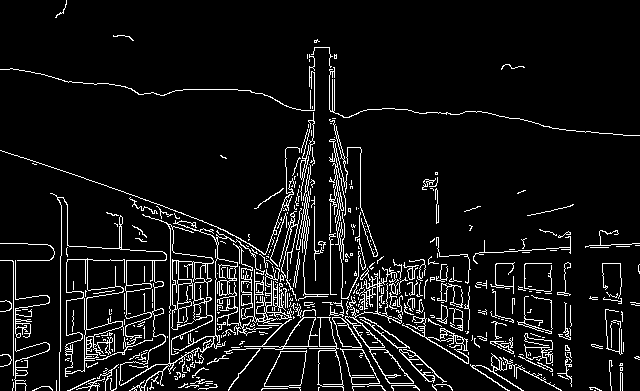

# 📐 Edge & Corner Detection
이미지 처리 및 컴퓨터 비전에서 **Edge Detection(에지 검출)** 과 **Corner Detection(코너 검출)** 은 물체의 형태와 구조를 인식하는 데 핵심적인 기법입니다.

에지는 이미지 내에서 픽셀 값이 급격하게 변하는 부분으로, 객체의 경계나 윤곽선을 나타냅니다. 이러한 에지를 검출함으로써 우리는 물체의 위치나 형상을 파악할 수 있습니다.

코너는 에지보다 더욱 국소적인 특징으로, 두 개 이상의 에지가 만나는 지점에서 나타납니다. 코너는 특징적인 위치 정보를 제공하기 때문에, 이미지 정합(image matching), 트래킹(tracking), 3D Reconstruction 등 다양한 응용에서 중요한 역할을 합니다.

이 디렉토리에서는 대표적인 에지 검출 기법들과 해리스 코너 검출 알고리즘에 대해 살펴보고, 각 방법에 따른 결과 차이를 함께 살펴보도록 하겠습니다.

 

## 📂 주요 주제

### 1. Edge Detection
- `Smoothing & Edge Tradeoff`
- `Sobel Filter`
- `Laplacian Filter`
- `Laplacian of Gaussian Filter (LoG)`
- `Canny Edge Detection`

### 2. Corner Detection 
- `Harris Corner Detection`

 

## 📌 결과 미리보기

> **Edge Detection - 1. Smoothing & Edge Tradeoff 결과**
 
kernel size 커질 수록 edge가 blurred된다. (localization 문제)

|kernel size = 1|kernel size = 1|kernel size = 1|kernel size = 1|
|:--:|:--:|:--:|:--:|
|||||

 

> **Edge Detection - 2. Sobel Filtering 결과**
 
x, y filtering(gradient 계산) 후 magnitude로 만들어 detection한다.

|원본|x축 필터링|y축 필터링|Magnitude(Final Result)|
|:--:|:--:|:--:|:--:|
|  |  |  |  |

 

> **Edge Detection - 3. Laplacian of Gaussian 결과**
 
2차 미분 기반의 LoG는 잡음에 민감하기 때문에, low-pass filtering을 통해 노이즈를 줄여야 한다. 
 
제로크로싱을 통해서 인접한 픽셀 간의 값이 부호가 바뀌면서 지정한 threshold 이상의 변화가 있을 경우 엣지로 판단.

|원본|가우시안 Blur|LoG|LoG(No Blur)|
|:--:|:--:|:--:|:--:|
|  |  |  |  |

 

> **Edge Detection - 4. Canny Edge Detector 결과**
 
    1. low-pass를 통한 blur, sobel filter를 통한 x,y 편미분 magnitude 와 angle계산
 
    2. Non-maximum Suppression으로 angle 방향을 따라가며 1 pixel 크기의 edge만 남긴다.
 
    3. Double Thresholding을 통해서 약한 Edge의 실제 Edge 여부 판단. 

|원본|Canny Edge Detector|
|:--:|:--:|
|  |  | 

> **Corner Detection - 1. Harris Corner Detector 결과**
 

 

## 🔗 작성 포스팅

#### EDGE
- 📐 [**Image Detection과 Edge-Smoothing Tradeoff에 대해서 알아보자**](https://he-kate1130.tistory.com/145)

- 📐 [**Sobel Filtering, Laplacian of Gaussian을 알아보자**](https://he-kate1130.tistory.com/147)

- 📐 [**Canny Edge Detection에 대해서 알아보자**](https://he-kate1130.tistory.com/148)

#### CORNER

- 📐 [**코너검출의 기본 아이디어와 Harris Corner Detection**](https://he-kate1130.tistory.com/149)

 

## 📖 참고 자료

