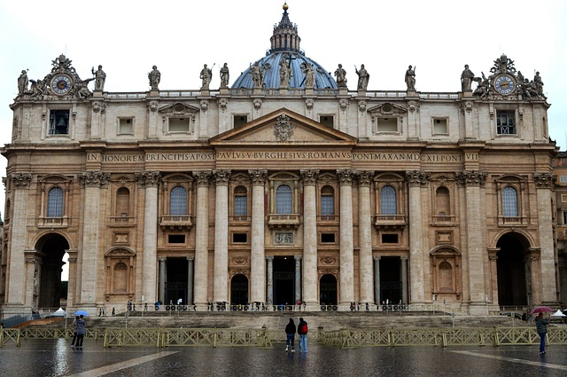
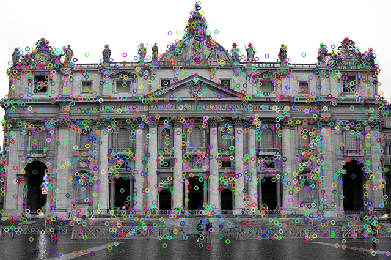
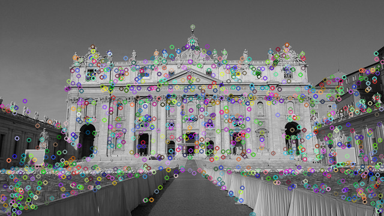
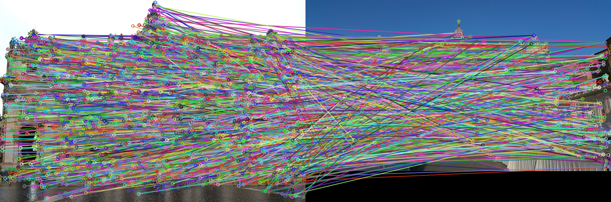
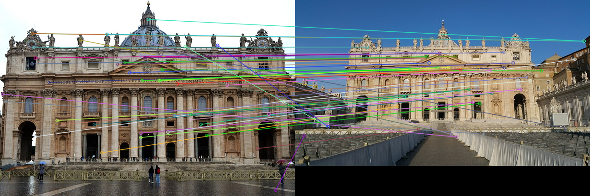

# 🔍 Feature Descriptor & Matching

이미지에서의 **Feature Detection**과 이를 이용한 **Feature Matching**은 컴퓨터 비전에서 매우 중요한 전처리 단계입니다. 

특징점(feature point)은 이미지에서 고유하고 안정적인 지점을 의미하며, 이를 기반으로 서로 다른 이미지 간의 정합, 추적, 재구성 등의 다양한 작업이 가능합니다.

특히 특징점 기반의 매칭은 이미지 스티칭(image stitching), 객체 인식(object recognition), SLAM 등 많은 응용 분야에서 사용되며, 다양한 검출기와 기술들이 제안되어 왔습니다.

이 디렉토리에서는 대표적인 특징점 검출 기법과 디스크립터(descriptor)알고리즘을 실험하고 그 차이를 시각적으로 확인해보겠습니다.

<br><br>
## 📂 주요 주제

### 1. Feature Descriptor
- ```Feature Descriptor```

- ```SIFT```

- ```FLANN + Lowe's Ratio Test```

- ```SURF```

<br><br>
## 📌 결과 미리보기

> **Feature Descriptor - 1. SIFT Keypoint 결과**
> 

|원본1|SIFT Keypoint 추출|원본2|SIFT Keypoint 추출|
|:--:|:--:|:--:|:--:|
|  |  |  |  |

> **Feature Descriptor - 2. SIFT Keypoint Matching 결과**
> 

|SIFT BruteForce KeyPoint Matching|
|:--:|
|  |

> **Feature Descriptor - 3. SIFT+FLANN+Lowe's Ratio Test 결과**
> 

|SIFT + FLANN + Lowe's Ratio Test|
|:--:|
|  |

<br><br>
## 🔗 작성 포스팅

#### Feature Descriptor
- 🔍 [**Feature Descriptor가 무엇일까?**](https://he-kate1130.tistory.com/150)

- 🔍 [**SIFT에 대해서 알아봅시다**](https://he-kate1130.tistory.com/151)

- 🔍 [**SIFT & FLANN + LOWE'S RATIO TEST**](https://he-kate1130.tistory.com/153)

<br><br>
## 📖 참고 자료

- [**OPEN CV: Introduction to SIFT**](https://docs.opencv.org/4.x/da/df5/tutorial_py_sift_intro.html)

- [**SIFT 논문**](https://link.springer.com/article/10.1023/B:VISI.0000029664.99615.94)